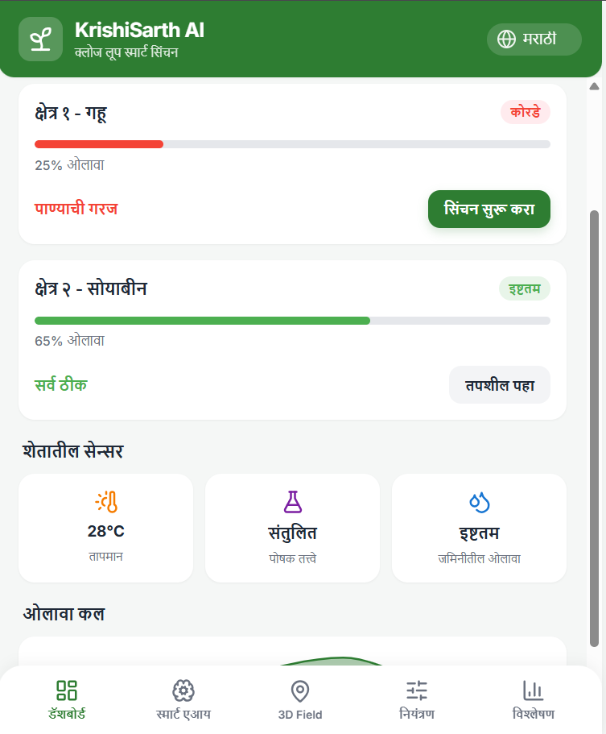
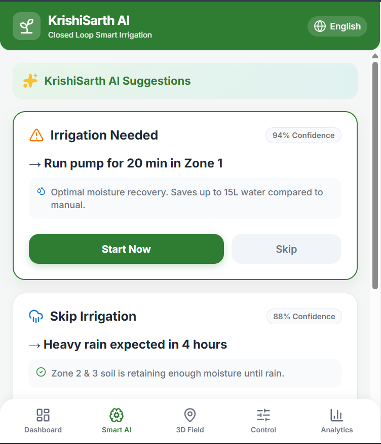
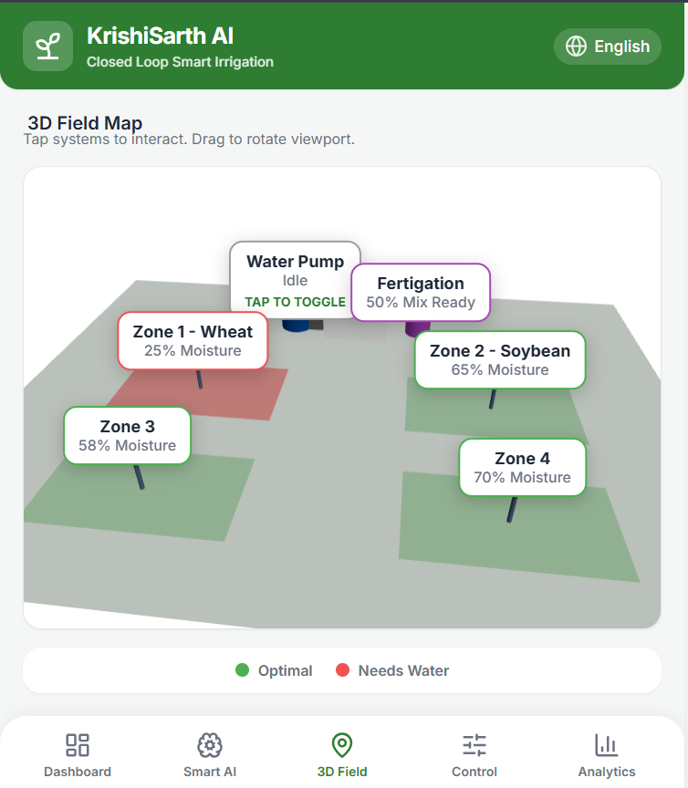
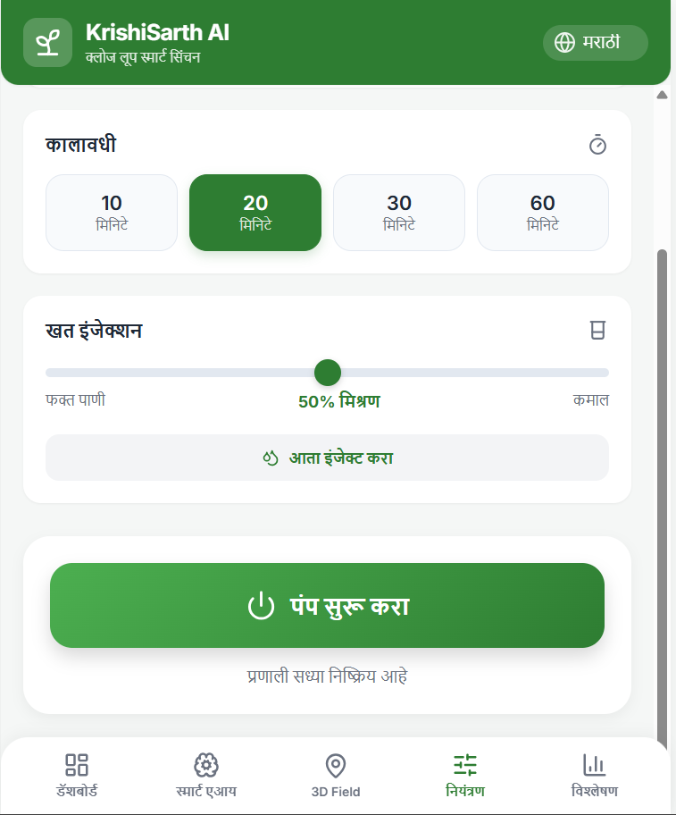

# 🌱 KrishiSarth AI: Smart Farmer Dashboard

> **The Interactive Frontend & Control Hub for the KrishiSarth Autonomous Farming Ecosystem**

[](#)
[](#)
[](https://opensource.org/licenses/MIT)

This repository contains the source code for the **KrishiSarth AI Smart Farmer Interface**. Designed with a mobile-first philosophy, this dashboard bridges the gap between complex edge-AI reinforcement learning and practical, everyday farm management. It provides real-time telemetry, 3D field visualization, and intuitive manual overrides for autonomous irrigation and fertigation systems.

---

## ✨ Key Features

* **🌍 3D Digital Twin Field Map:** An interactive, rotatable 3D viewport that visualizes independent crop zones in real-time. Farmers can tap physical system nodes (like Water Pumps and Fertigation tanks) directly on the map to view status or toggle operations.
* **🧠 Smart AI Predictions & Alerts:** Translates backend ML data into actionable, confidence-based insights. Examples include auto-skipping irrigation if heavy rain is expected (e.g., *88% Confidence*) or suggesting specific nutrient injections.
* **🎛️ Granular Manual Control:** While the system is autonomous, the UI provides absolute manual override capabilities. Users can select target zones, set specific timer durations, and adjust fertigation injection mixes (e.g., *58% Urea Mix*) via an intuitive slider.
* **📊 Comprehensive Crop & Soil Analytics:** Real-time dashboards displaying cumulative water saved (e.g., *450L*), historical moisture trends, live temperature, and overall nutrient balance.
* **🌐 Multilingual Accessibility:** Built-in language selector (English, Marathi, Hindi) ensuring the interface is genuinely accessible to local agricultural communities.

---

## 📸 Interface Showcase

*(Note: Add your actual screenshot files to an `assets` folder in your repo and update these paths so judges can see the UI immediately)*

| Dashboard & Telemetry | Smart AI Recommendations |
| :---: | :---: |
|  |  |
| **3D Field Visualization** | **Manual System Control** |
|  |  |

---

## 🚀 Installation & Setup

To run the farmer dashboard locally for testing or development:

1. **Clone the repository:**
   ```bash
   git clone [https://github.com/YOUR-USERNAME/krishisarth-ui.git](https://github.com/YOUR-USERNAME/krishisarth-ui.git)
   cd krishisarth-ui
